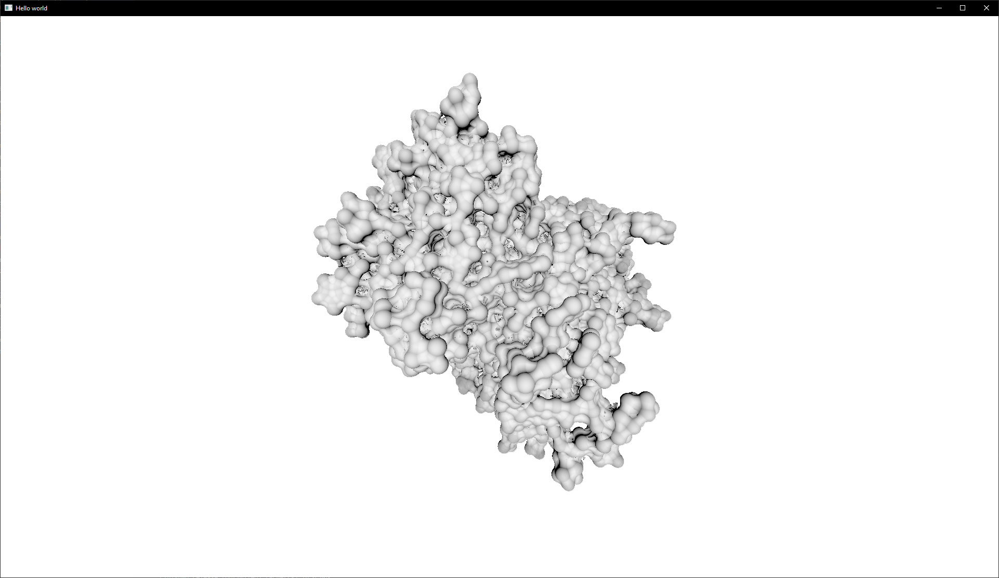
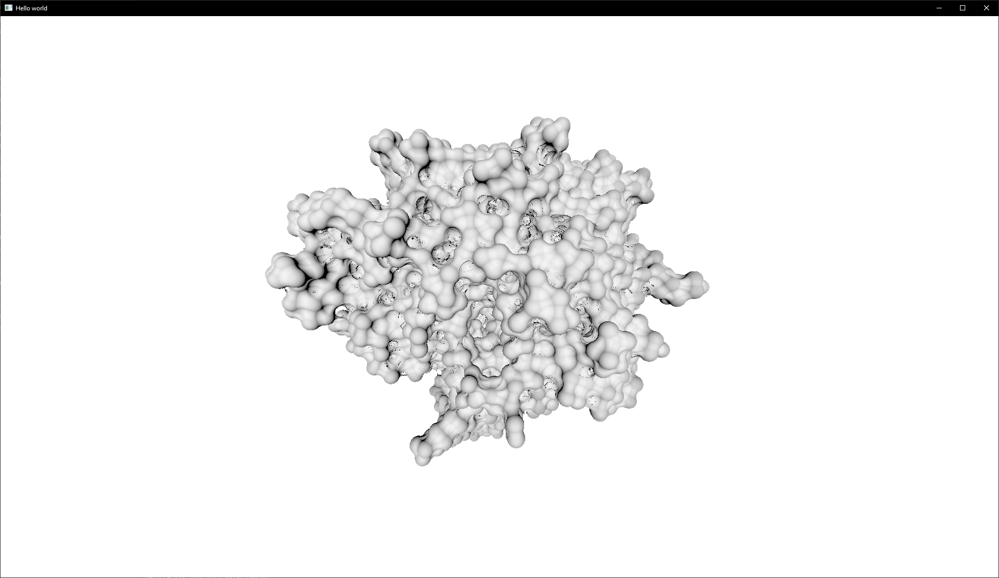

# Visualization 2: Implicit Representation of Molecular Surfaces

This is an implementation of paper [Implicit Representation of Molecular Surfaces](https://www.researchgate.net/publication/254026672_Implicit_Representation_of_Molecular_Surfaces) for Visualization 2 course at TU Wien.

## Compilation

Install the rust compiler and Its package manager cargo. The best way to do so is by simply installing [rustup]https://rustup.rs/.

## Running

You need a GPU capable of running either DirectX 12 or Vulkan.

Either run the compiled executable from `bin/molecules.exe` or use `cargo run --release`.

Drop any `.pdb` file you want to view.

## Documentaion

You can find all the documentation inside `doc` folder. Open `doc/molecues/index.html` for main page.

## Showcase

## License
[MIT](https://choosealicense.com/licenses/mit/)